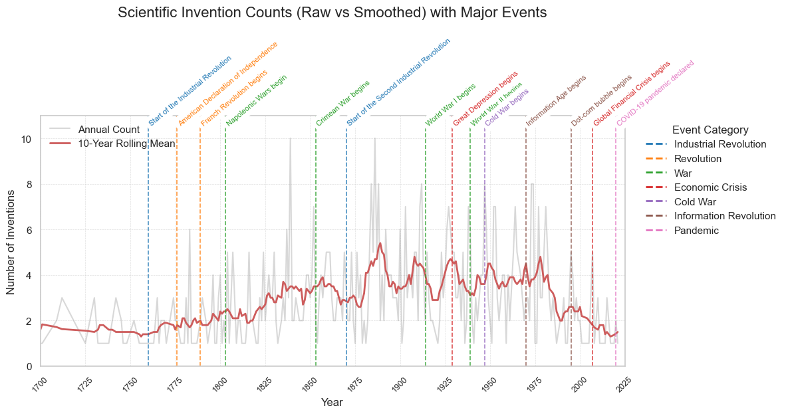

# DALAS-EDA-PROJECT

This project is for the DALAS class at Sorbonne Université. It focuses on collecting, cleaning, and visualizing data about scientific inventions and discoveries over time. The work is divided into three parts: data scraping, cleaning, and visualization. Each part is stored in separate folders under `src`, with raw and processed data in `raw_data`.

The `src/scrape_script` folder has notebooks that scrape data from websites and PDFs, saving results as CSV files in `raw_data/scrape_data`.

The `src/clean_scripts` folder contains a notebook that merges and cleans all raw data. It standardizes country names, groups invention categories, normalizes text, and removes duplicates using fuzzy matching. The cleaned data is saved as `raw_data/clean_data/clean_data_dd.csv`.

The `src/visualization_scripts` folder has notebooks that load the cleaned data and create charts such as annual counts, rolling trends, country-based bubbles, heatmaps, pie charts, and statistical comparisons. It also uses PCA and clustering to find patterns.

To reproduce the analysis, run the scraping notebooks first, then the cleaning notebook, and finally the visualization notebooks. Dependencies are listed in `requirements.txt`. The clear folder structure helps follow the full data workflow.

